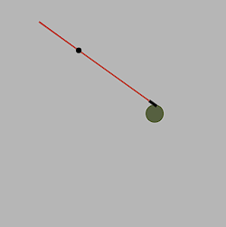
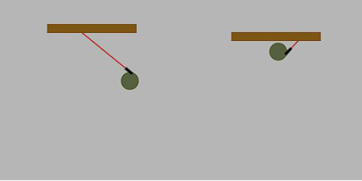
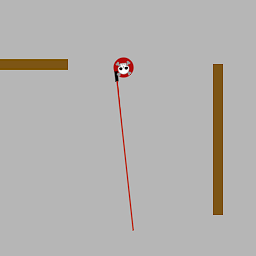
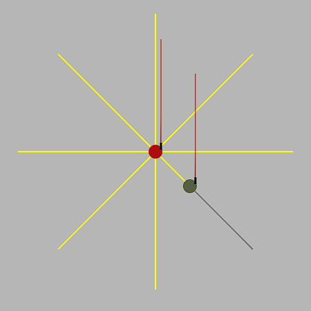
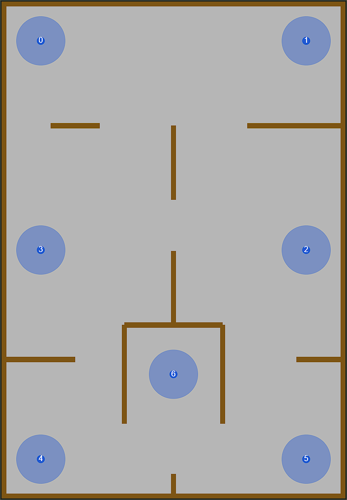
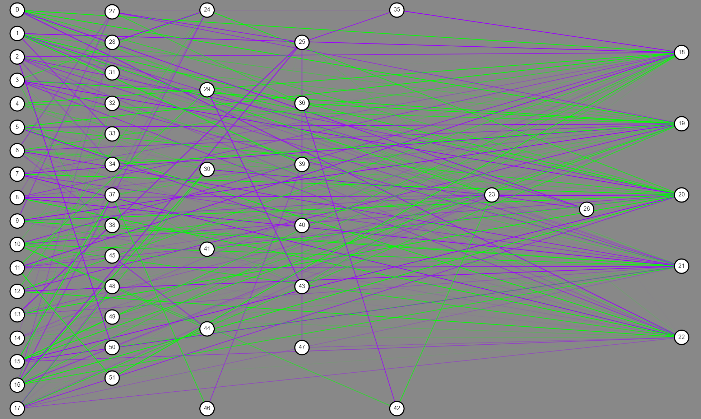
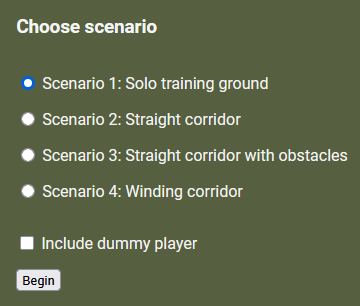

# Training Ground

This project is a platform for training neural networks and testing their abilities and efficiency in playing a 2D shooter game.

Yes, this is a neural network training environment written in JavaScript and it is designed to be run in the browser! Also, notice that there are no functional dependencies in package.json file. Everything here is built from scratch.

## Project's goal

The goal was to compare performance of two neural networks, trained with a different methods of [neuroevolution](https://en.wikipedia.org/wiki/Neuroevolution). The first is the standard neuroevolution, where the network's topology is static and the only network parameters (values that are adjusted during training) are weights on the edges. Second method, is the member of TWEANN (Topology and Weight Evolving Artificial Neural Networks) family - [NEAT (NeuroEvolution of Augmenting Topologies)](https://en.wikipedia.org/wiki/Neuroevolution_of_augmenting_topologies). In this case, the nodes and edges of the network are also changing during the training process.

## Game rules

The game is very simple. There are five controls: move forward ⬆️, move backward ⬇️, rotate left ⬅️, rotate right ➡️ and shoot [spacebar].

The game area has walls which cannot be passed by any other object.

Once shot, the player's controls are disabled.

The player has the advantage of seeing the whole map. The AI's sight is limited to 8 sensors, which allow reacting to walls and the player.

## Features

The application has three modes: training, evaluation and playing.

### Training mode

Training takes place in a simple environment, where the AI players get introduced to all the game-related concepts, like exploring, navigating between walls and shooting.

These blue circles you see are sectors that are marked for the bots to teach them exploring for the player.

Once you decide that you already have your champion, you can export the current best brain to a text file, which can be later imported in other modes. I included two examples of trained brains in the brains/ folder.

There is an option to view the current champion's neural network topology, though it might be interesting only while training NEAT entities.

### Evaluation mode

Here, the already trained AI can be tested against different evaluation scenarios.

The goal of the first scenario is to reach as many sites as possible in 5000 frames. For all the others, it is about reaching the end of a road within 2000 frames. A dummy player can be spawned in each scenario, for shooting efficiency evaluation.

### Playing mode

This is a straightforward PvP mode. You import the AI brain and commence a real human vs machine battle!
